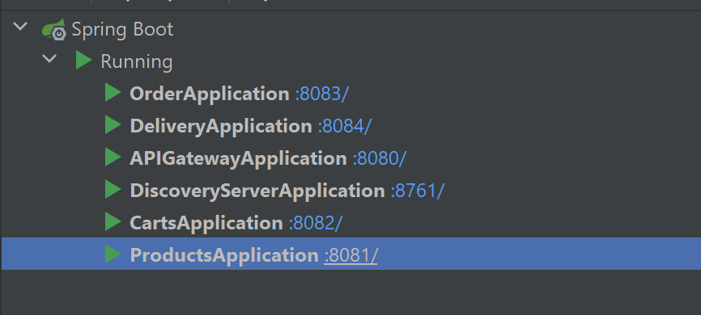
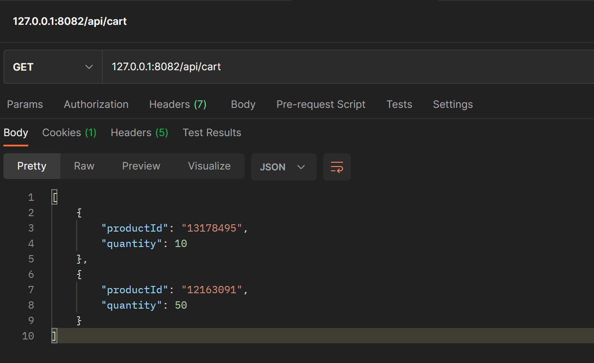
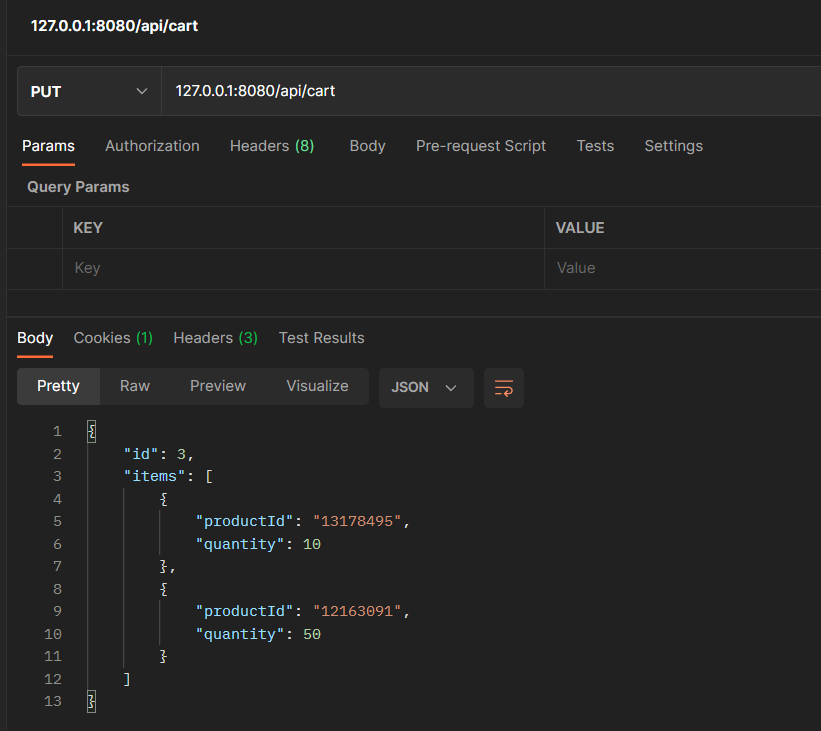
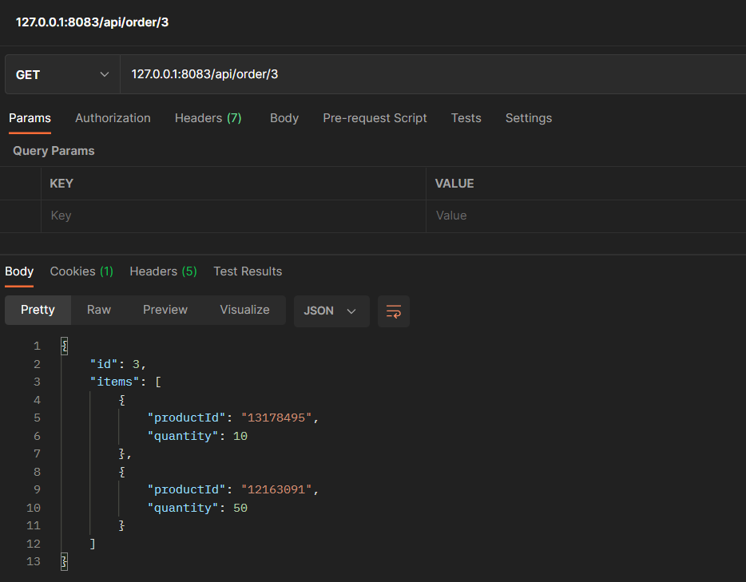
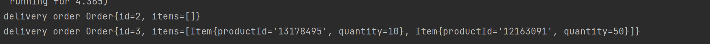

# aw07

changelog:
1. 修改pos-cart, 增加checkout的api, 使当前购物车生成订单并且清空, 返回生成的订单信息.
2. 增加pos-order, 负责所有的订单服务 (生成订单, 查询订单, 分发订单)
3. 增加pos-delivery, 通过消息组件接收分发的订单进行处理.
4. 重构工程, 提取公共模块, 删除冗余代码.

运行效果:
1. 启动的微服务, (同时还有RabbitMQ服务):

2. 增加购物车:

3. checkout生成订单, 可以看到获取的订单编号为3

4. 向订单服务查询, 可以看到还未分发的订单3:

5. 发送分发订单请求, pos-order生产订单分发的消息, 并且可以从pos-deliver服务中获取到:

